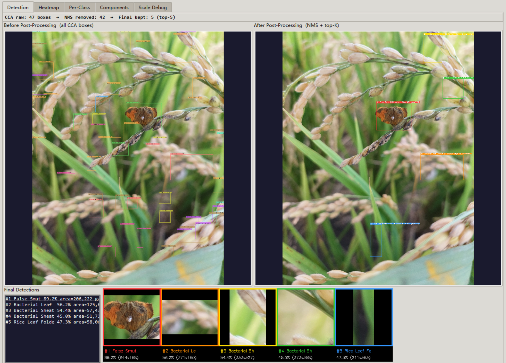
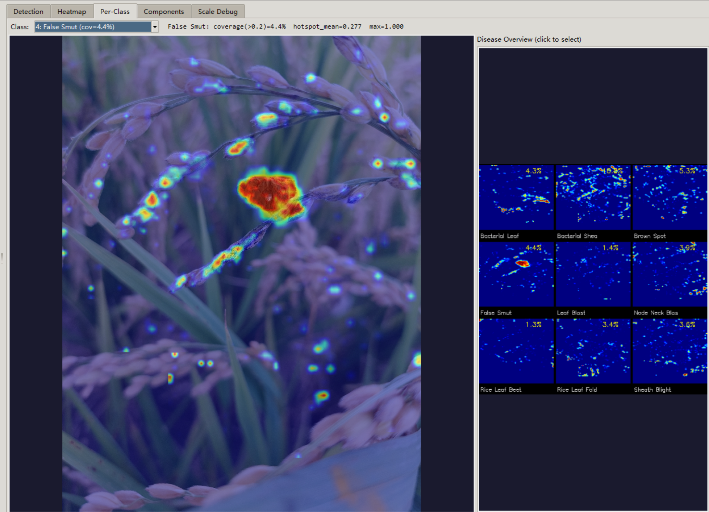
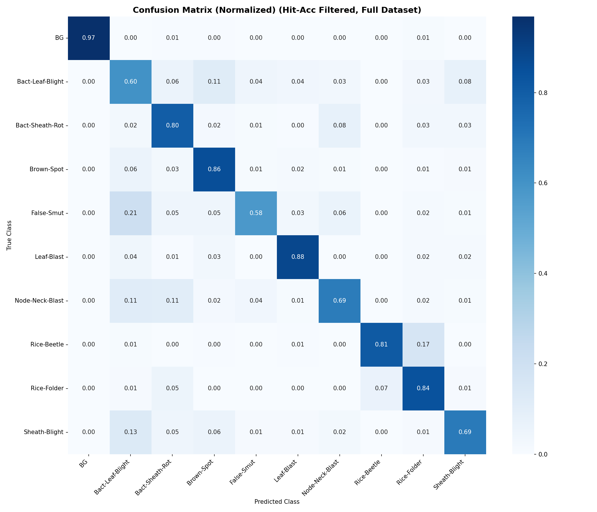

# Weakly-Supervised Rice Disease Detection via Asymmetric Multiple Instance Learning

> **From image-level labels to pixel-level localization** — detecting and localizing 9 rice diseases without any bounding box or pixel annotations.

<!--
<p align="center">
  
</p>
-->

---

## Overview

Traditional rice disease detection requires expensive pixel-level or bounding-box annotations from domain experts. This project decreased that requirement:

- **Input**: Image-level labels only ("this image contains Brown Spot")
- **Output**: Spatial heatmaps + detection boxes showing *where* the disease is
- **9 disease classes** + background (10-class classification)
- **Hardware**: Trained entirely on RTX 4060 Laptop (8GB VRAM)

## Architecture


## Results




> top-1 detection box scores 0.892; other top-2~5 boxes below 0.6



### Key Results

| Metric | Value |
|--------|-------|
| Background Recognition | **96.8%** |
| Overall Accuracy (filtered) | **81.3%** |
| Avg Top-1 Confidence | **97.8%** |
| Negative Hallucination | **3.6%** |
| Tiles Retained | **47.3%** |

<p align="center">

</p>

---

## Method: Scout-Snipe Asymmetric MIL

### Core Idea

In weakly-supervised MIL, a "bag" (image) contains many tiles, but only some are truly diseased. Naively training on all tiles introduces massive label noise. Our solution: **separate the search from the learning**.

```
SCOUT PASS (no gradient)
  All tiles → model.eval() → score each → Select Top-K disease tiles
                                              ↓
SNIPE PASS (gradient enabled)
  Top-K tiles + negative tiles → model.train() → Tiered loss → Backprop
```

The Scout explores without contaminating gradients. The Snipe trains only on high-quality selections.

### Critical Foundation: Negative Pool

The entire framework rests on a confirmed-clean negative sample pool (46,391 tiles from verified healthy rice images). This establishes a calibrated background baseline — without it, the model bootstraps from its own uncertain beliefs.

---

## Architecture: CNN-ViT Hybrid with FPN

```
Input (B, 3, 384, 384)
    ↓
EfficientNetV2-RW-S Backbone
    Stages 0-2: FROZEN (ImageNet features)
    Stages 3-7: TRAINABLE (disease-specific)
    ↓
FPN Neck (Multi-scale Fusion)
    Stage 3 (160ch, 24×24) + Stage 4 (1792ch, 12×12)
    → Fused output: (B, 256, 24×24)
    ↓
ViT Residual Block (Global Attention)
    576 tokens, 8 heads, learnable 2D PE
    0.94M params (41× reduction vs full-dim placement)
    ↓
HeatmapHead
    Conv1×1 → 10 channels (spatial disease response)
    TopK-Mean Pooling → class logits
```

**Total**: 24.18M parameters (Backbone 22.15M, FPN 1.09M, ViT 0.94M)

**Design decision**: ViT placed *after* FPN dimension reduction (256ch), not before (1792ch), achieving 41× parameter reduction with no loss in spatial modeling.

---

## Training: Three-Tier Quality-Aware Loss

### Phase 1 — Warmup (Epochs 1–15)
- Top-1: Strong CE (×5.0) as anchor signal
- Top-2~K: Weak CE (×0.1)
- Inter-bag ranking loss for margin-based separation

### Phase 2 — Stable (Epochs 16–30)

| Tier | Condition | Top-1 | Top-2~K |
|------|-----------|-------|---------|
| **Tier 1** (Qualified) | Correct & conf > 0.45 | Strong CE (×5.0) | Per-bag KL distillation |
| **Tier 2** (Marginal) | Correct & conf ≤ 0.45 | Full CE (×1.0) | Weak CE |
| **Tier 3** (Wrong) | Incorrect | Noise Drop / Correction | Silence |

### Per-Bag KL Distillation (Key Innovation)

Standard batch-mean KL causes **heatmap diffusion** — mixing cross-class distributions makes the model "see disease everywhere." Our dual-gate per-bag approach ensures each tile learns from its own bag's highest-quality prediction:

- **Gate A** (bag-level): Is this bag's Top-1 a Tier 1 prediction?
- **Gate B** (tile-level): Does this tile's argmax match the bag label?
- Both pass → KL using *this bag's own* Top-1 soft distribution
- Either fails → Fallback to weak CE

---

## Anti-Collapse Mechanisms

| Mechanism | Problem Solved |
|-----------|---------------|
| BN frozen in Snipe pass | Scout/Snipe statistics divergence |
| Tier 2 full weight (1.0) | Prevents Silence Spiral on marginal predictions |
| Per-bag KL (not batch-mean) | Prevents cross-class heatmap diffusion |
| Tier 3 safety net | Weak CE fallback when all Top-1s fail |
| Scale Diversity | Multi-scale tile deduplication |
| Confidence threshold 0.45 | Meaningful quality gate above random baseline |

---

## Inference Pipeline()

```
raw image (H×W)
  │
  ├─ _select_tile_sizes() → [768, 1024, 1536]（large image）or [384, 512, 768]（small image）
  │
  ├─ tile_size:
  │    ├─ stride = tile_size × 0.5
  │    ├─ Sliding window cut tile（including edge handling）
  │    ├─ each tile → resize到384×384 → 模型推理
  │    │    ├─ get_spatial_heatmap() → (N, 10, 24, 24) → softmax → resize回tile区域
  │    │    └─ predict_instances() → (N, 10) → 记录tiles_info
  │    │
  │    └─ Weighted cumulative heatmap_accum:
  │         ├─ scale_weight = ts / max_ts（large scale tile have high weight）
  │         ├─ bg_aware_weight = max(0, 1 - 2×bg_prob)（degrade high bg tile disease channel）
  │         └─ feather_window（Hann window eliminates splicing marks）
  │
  ├─ TopK spatial normalization （each disease channel divide by its top-3 average） 
  │
  └─ extract_detections():
       ├─ each diseases percentile threshold → binary → Morphology → CCA → bbox
       ├─ cross-class IoU NMS (>0.3 merge)
       ├─ BG-region filter（bg_prob mean >0.7 delete）
       └─ ranking by area×confidence → top_k
```
> Now considerating replace its function usingAdaptive Perception - Prototype of the decision loop（Preliminary plan :Depth Anything V2 + GRU decision module）
```
Freeze components (The model trained by this project's strategy):
├─ Disease classification model (ONNX)
└─ Depth Anything V2 Small (pre-trained)
Learnable components:
└─ Decision Module (lightweight GRU/MLP)
     input: class confidence + heatmap entropy + depth features + action history
     output: {zoom_in, zoom_out, shift, stop}
```
Progress: Writing a rule-based version - validating concepts


```

Features:
- **Adaptive tile selection**: Large images use [768, 1024, 1536], small images use [384, 512, 768]
- **Scale-weighted fusion**: Large tiles get higher weight to prevent small-tile signal domination
- **Tile-edge feathering**: Raised cosine windows eliminate grid artifacts at tile boundaries
- **BG-aware reweighting**: Tiles with bg_prob ≥ 0.5 contribute zero to the disease heatmap

---

## Ablation Study

| Config | Neg Recall | Hit Acc | Overall Acc (filtered) | Neg Hallucination |
|--------|:---:|:---:|:---:|:---:|
| 0209 (Baseline) | 94.7% | 98.1% | 71.2% | 6.9% |
| 0224 | 94.1% | 98.3% | 67.9% | 7.5% |
| 0225 | 90.9% | 99.1% | 66.0% | 10.7% |
| **0226 (Final)** | **96.8%** | **98.7%** | **81.3%** | **3.6%** |

The combination of conf_threshold=0.45 + Tier 2 full weight + warmup 15 epochs produces the best results, with a 10+ point jump in overall accuracy demonstrating synergistic effects.

---

## Negative Results

These failed experiments informed our final design:

1. **Feature Critic with ImageNet features** — Pretrained features see healthy and diseased tiles as nearly identical (cosine sim gap: −0.0009). ImageNet provides no meaningful prior for rice pathology.

2. **Spatial NMS** — Limited effectiveness With tile overlap. Replaced with Scale Diversity.

3. **Negative Rejection loss** — Gradient direction ("don't be disease" to top2~k) conflicts with Top-1 CE ("be this disease"), causing progressive suppression of positive responses.

---

## Per-Class Performance

| Class | Precision | Recall | F1 |
|-------|:---------:|:------:|:--:|
| Background | 1.000 | 0.969 | 0.984 |
| Leaf Blast | 0.895 | 0.882 | 0.888 |
| Rice Leaf Beetle | 0.955 | 0.811 | 0.877 |
| Brown Spot | 0.820 | 0.857 | 0.838 |
| Node Neck Blast | 0.879 | 0.686 | 0.770 |
| Sheath Blight | 0.765 | 0.695 | 0.728 |
| Bact. Sheath Brown Rot | 0.664 | 0.799 | 0.726 |
| False Smut | 0.752 | 0.578 | 0.653 |
| Rice Leaf Folder | 0.430 | 0.843 | 0.570 |
| Bact. Leaf Blight | 0.392 | 0.603 | 0.475 |

---

## Dataset

| Property | Value |
|----------|-------|
| Positive bags (images) | 2,819 |
| Negative bags (images) | 1,127 |
| Disease classes | 9 |
| Positive tiles (multi-scale) | 158,277 (100K train / 58K val) |
| Negative tiles (multi-scale) | 46,391 (37K train / 9K val) |
| Tile scales | 512 / 768 / 1024 / 1536 / 2048 px |
| Model input size | 384 × 384 |

---

## Project Structure

```
rice_detection/
├── configs/                  # YAML configuration files
│   ├── algorithm/            # MIL strategy, loss, feature critic
│   ├── dataset/              # Data paths, augmentation, pools
│   ├── model/                # Architecture, hybrid components
│   └── trainer/              # Optimizer, scheduler, evaluation
├── scripts/
│   ├── train.py              # Training entry point
│   └── tools/                # Data preprocessing utilities
├── src/
│   ├── core/                 # Config, registry, base classes
│   ├── data/                 # Dataset, tile pools, augmentation
│   ├── models/               # EfficientNetV2 + FPN + ViT + heads
│   ├── losses/               # TopK-Anchored MIL loss (tiered)
│   ├── trainer/              # Asymmetric MIL trainer loop
│   ├── inference/            # Unified engine + GUI + detection
│   ├── evaluation/           # Metrics, validation
│   ├── critics/              # Feature Critic (experimental)
│   └── utils/                # Logging, visualization
└── deploy/                   # Deployment utilities (WIP)
```

---

## Technical Environment

| Component | Specification |
|-----------|---------------|
| GPU | NVIDIA RTX 4060 Laptop (8GB VRAM) |
| Framework | PyTorch + timm + Albumentations |
| Backbone | EfficientNetV2-RW-S (ImageNet pretrained) |
| Training VRAM | ~2.4 GB (with AMP) |
| Inference VRAM | ~1.0 GB (32 tiles batch) |
| Data storage | LMDB (tile pools with precomputed features) |

---

## Publication

**Deep Learning Methods for Rice Disease Detection: Evolution and Challenges**
X. Shuwei et al. — Published in *RoViSP 2025* (International Conference on Robotics, Vision, Signal Processing and Power Applications)

---

## License

This project is part of an MSc thesis at Universiti Sains Malaysia.
